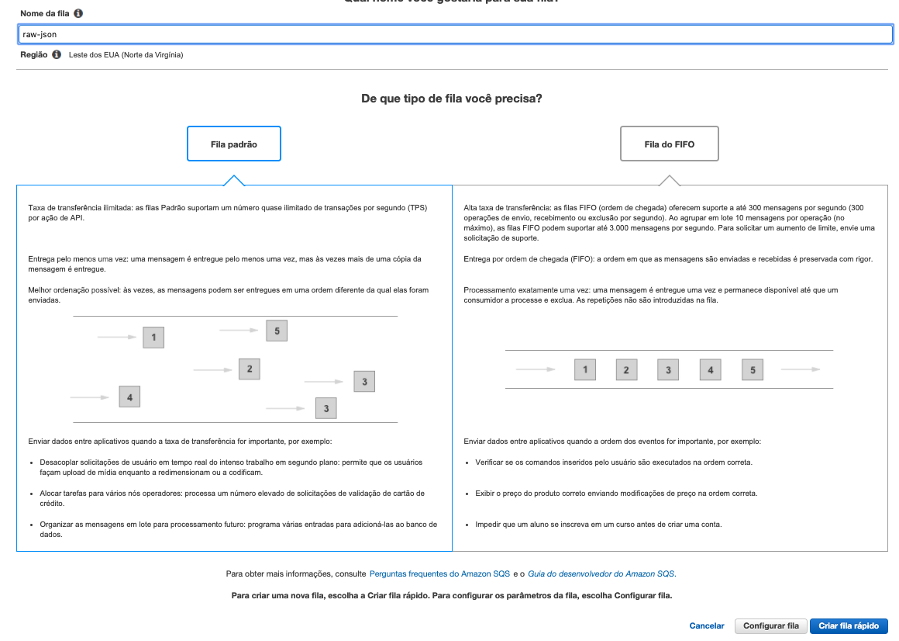
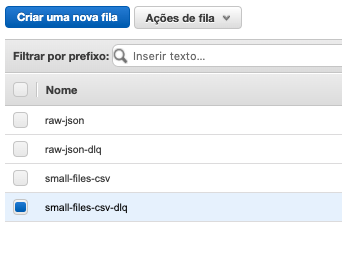
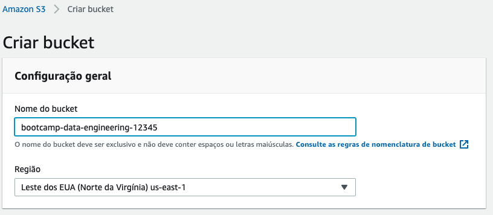
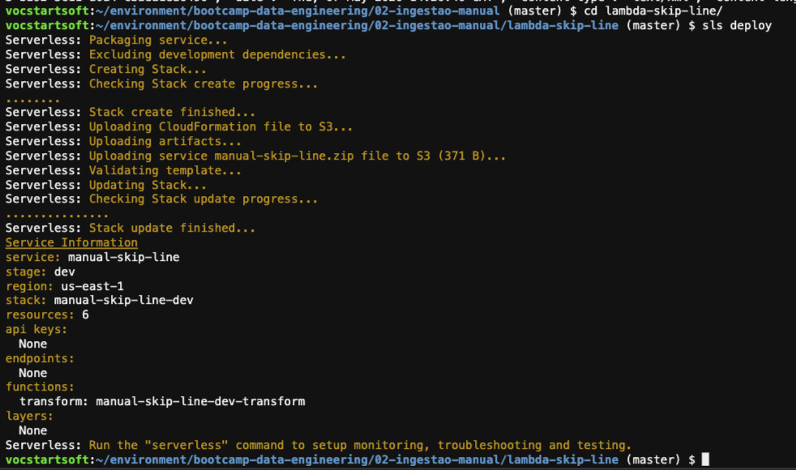
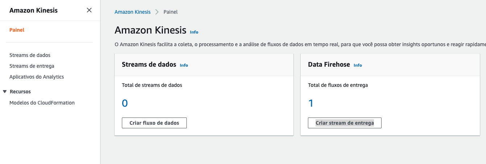
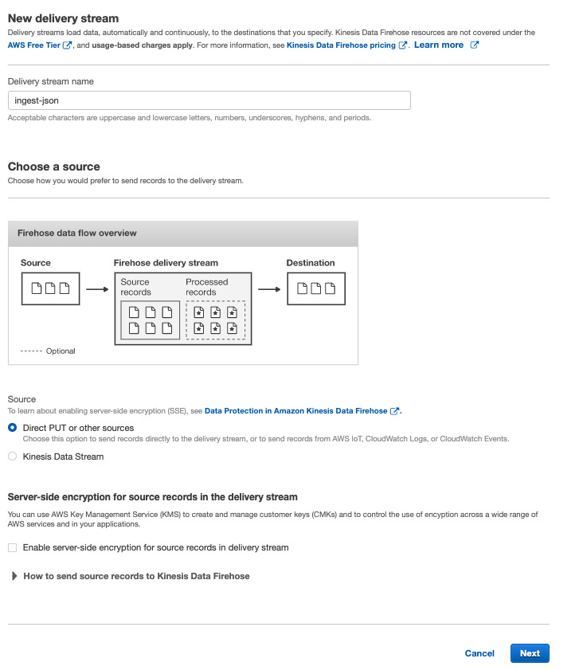
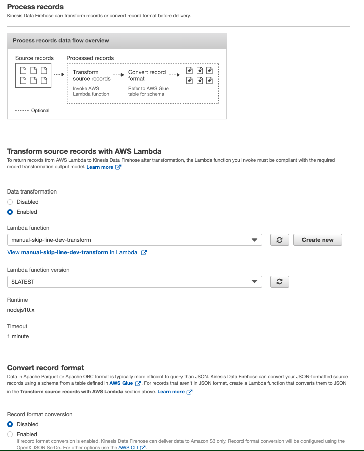
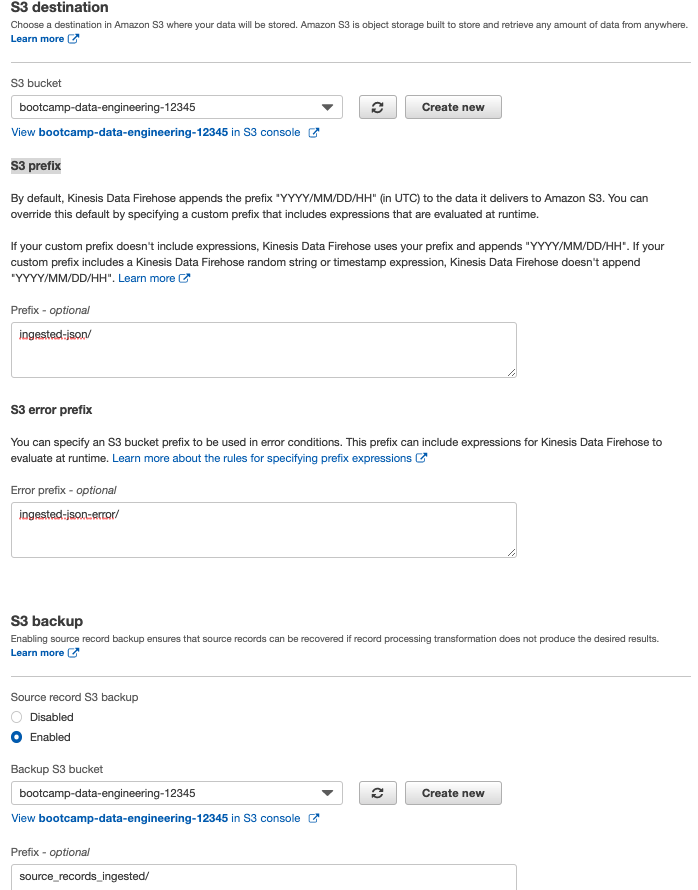
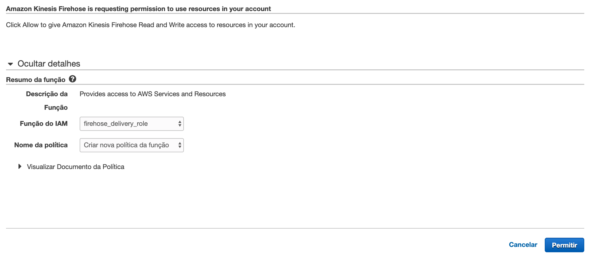
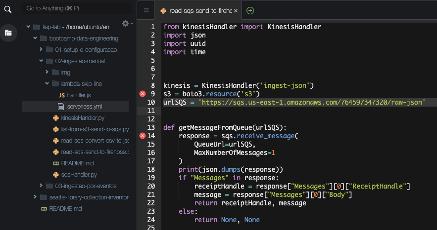

# 02 - Ingestão Manual

1. Primeiro vamos criar 4 filas no SQS, para isso abre o console e no canto esquerdo superior clique em `serviços`, digite `sqs` e selecione para abrir.
   
2. Inicialmente vamos criar as 2 filas DLQ: `raw-json-dlq` e `small-files-csv-dlq`. 'Clique em criar uma nova fila', apenas coloque os nomes, mantenha as opções padrão e clique em 'Criar fila rápido'.
   
3. Agora vamos as filas principais: `raw-json` e `small-files-csv`. Clique novamente em 'Clique em criar uma nova fila' coloque o nome e clique em configurar fila. Em `Configurações da Fila de mensagens mortas` deixe como na imagem. Lembrando que cada fila tem sua respectiva DLQ. E clique em `Criar fila`
   
4. Ao final devem haver 4 filas:
   
5. Para não precisar lidar com um arquivo muito grande vamos dividir em varias partes, para tal vá ao terminal do cloud9.
6. Entre na pasta do dataset com o comando `cd ~/environment/seattle-library-collection-inventory/`
7. Crie a pasta para os arquivos menores com o comando `mkdir files-small`
8. Vamos criar arquivos de 100.000 linhas cada com o comando`split -d -l 100000 library-collection-inventory.csv files-small/inventory.part.` 
9. Pode ser que o comando demore um pouco para executar
10. Enquanto o código executa vamos criar o bucket que será utilizado no bootcamp. Para isso vá ao console do S3.
11. No canto supeiror direito clique em `Criar bucket`
12. Os nomes no S3 são unicos em toda a AWS não somente sua conta, vamos nomear seu bucket como `bootcamp-data-engineering-<SEU RM>` e clique em criar bucket
    
13. Devolta ao terminal do CLoud9, agora vamos retirar o cabeçalho do primeiro arquivo para que não atrapalhe na ingestão. Para tal utilize o comando `sed -i '$d' files-small/inventory.part.00`
    
14. Agora é hora de colocar os arquivos no S3, para isso execute o comando: `aws s3 cp --recursive ~/environment/seattle-library-collection-inventory/files-small/ s3://bootcamp-data-engineering-<SEU RM>/files-small/`
15. Vá para a pasta do projeto que baixou do git com o comando `cd ~/environment/bootcamp-data-engineering/02-ingestao-manual/`
16. No IDE navegue até o arquivo `list-from-s3-send-to-sqs.py` e altere o valor da variavel `bucket` pelo nome do bucket que criou, a variável `urlSQS` pela URL da fila `files-small-csv` que criou e a variável `keyprefix` com o conteudo 'files-small/'. 
    
    
17. Execute o arquivo no terminal com o comando `python3 list-from-s3-send-to-sqs.py`
18. Se for ao painel do sqs e atualizar verá que a fila files-small-csv tem 356 itens disponiveis. Um para que arquivo no S3. Essa é uma maneira segura de consumir os arquivos e garantir que caso tenha uma falha o registro vá para a fila de DLQ, sendo facilmente restreavel.
19. Agora é necessário consumir a fila, converter e salvar os jsons no S3. Para isso altere as variaveis `bucket` e `urlSQS` como fez no passo 16 no arquivo `read-sqs-convert-csv-to-json.py`.
20. Execute o comando `python3 read-sqs-convert-csv-to-json.py` para executar o arquivo e iniciar o processo.
21. O processo pode demorar, para acelerar pode abrir até 4 terminais, entrar na pasta e exevutar o comando do passo 20. Até 4 porque seria o limite da maquina já que essa operação consome bastante IO e CPU. É possivel acompanhar o progresso atualizando o painel do SQS.
22. Após o fim da execução vamos precisar novamente do arquivo `list-from-s3-send-to-sqs.py`, dessa vez altere a variável `urlSQS` para a URL da fila `raw-json` e a variável `keyprefix` para o conteúdo 'json/'
    
23. No terminal execute o comando `python3 list-from-s3-send-to-sqs.py`. Isso irá preencher a fila `raw-json` com 356 registros correspondentes aos arquivos na pasta json.
24. Vamos criar o lambda que será utilizado pelo firehose. Execute o comando `cd lambda-skip-line/` e dentro da pasta execute `sls deploy`
    
25. Vamos criar o kinesis firehose que vamos utilizar nesse bootcamp. Em outra aba vá para o console do kinesis. CLique em `Criar stream de entrega`
    
26. De o nome de `ingest-json` e clique em 'next'
    
27. Na seção `Transform source records with AWS Lambda` deixe como na imagem escolhendo o lambda que acabou de criar e clique em 'next'.
    
28. Na seção 'S3 destination' escolha o bucket que acabou de criar.
29. Na seção 'S3 prefix' coloque os valores `ingested-json/` em 'Prefix - optional', `ingested-json-error/` em 'Error prefix - optional'.
30. Na secão 'S3 backup' escolha o bucket que criou e popule `source_records_ingested/` em 'Prefix - optional' e clique em 'Next'
    
31. Na seção 'S3 buffer conditions' coloque o valor `100` em 'Buffer size' e `300` em 'Buffer interval'.
    
32. Na seção 'Permissions' clique em 'Create new or choose'
33. Na aba que abriu apenas clique em 'permitir' no canto infeiror direito para criar o IAM do firehose.
    
34. Clique em 'Next'
35. Revise as informações e clique em `Create delivery stream`
36. Vamos alterar um parametro da fila `raw-json`. Vá até o painel do sqs, selecione a fila e clique em 'Açoes de fila'. Clique na opção `Configurar fila`
37. Altere o valor de 'Tempo limite de visibilidade padrão' para `2 MINUTOS` e 'Atraso de entrega' para `20 segundos`. O primeiro parametro é o tempo que o consumidor tem para deletar o registro da fila após ler. O segundo é o tempo de atraso da primeira entrega do registro na fila, ele é interessante pois o S3 é assincrono e pode demorar alguns poucos segundos para o objeto ficar disponível.
    
38. De volta ao cloud9, altere o arquivo `read-sqs-send-to-firehose.py` colocando a URL da fila `raw-json` na variável `urlSQS`
    
39. Após 20 segundos da inserção, execute o comando `python3 read-sqs-send-to-firehose.py` para ler os arquivos do S3 que estão listados no SQS e mandar para o Firehose. Pode executar esse comando em até 10 terminais na maquina. O processo pode ser acompanhado no painel do SQS.
40. É possivel ver os arquivos sendo criados no S3 dentro da pasta ingested-json